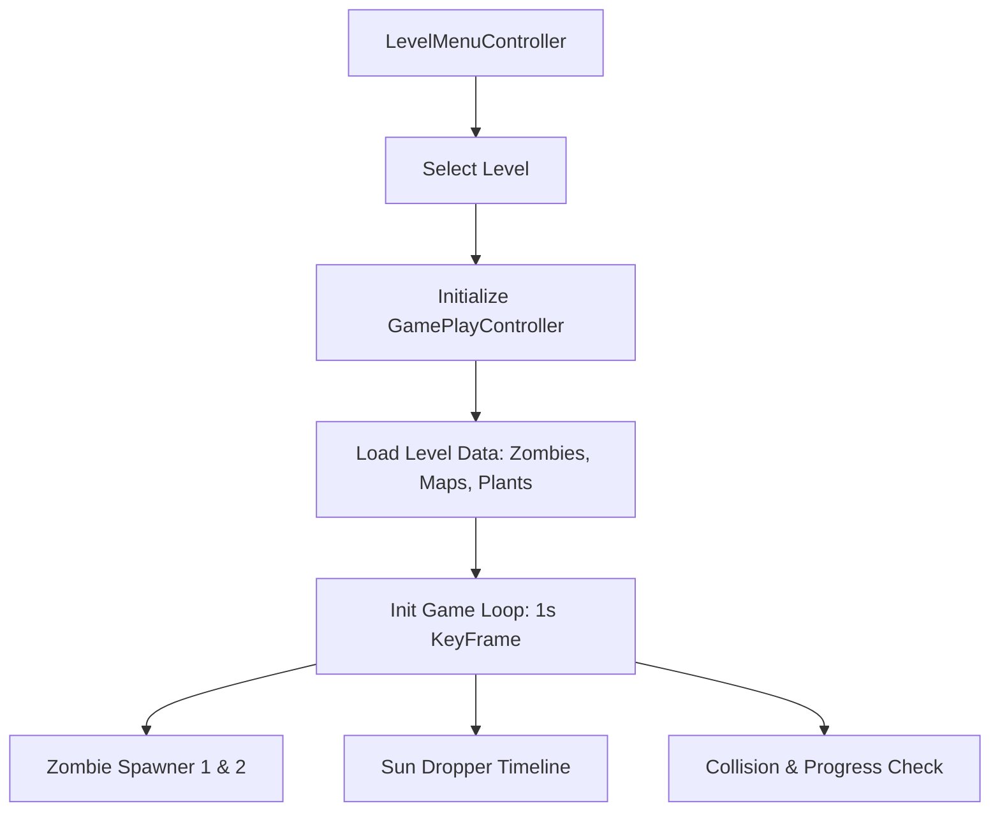
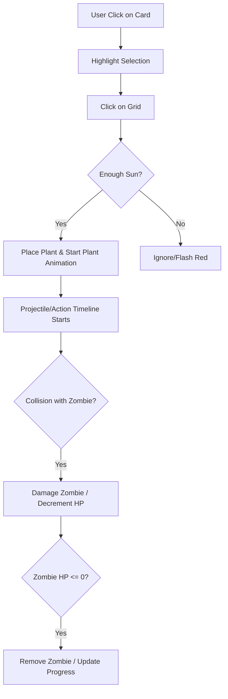

# 🛠️ How I Built "Flora Fight Frenzy"

**By Anamay (Flamechargerr)**

This document breaks down the architectural design, development process, and execution flow of the Flora Fight Frenzy project.

---

## 🏗️ Project Architecture

The game is built using the **JavaFX** framework, following a Model-View-Controller (MVC) approach where UI is defined in `.fxml` files and logic is handled in `.java` controllers.

### 🗺️ System Flow Maps

#### 1. Application Startup Flow
```mermaid
graph TD
    A[Main.java] --> B[Deserialize Database]
    B --> C[Initialize MediaPlayer/Background Music]
    C --> D[Load MainPage.fxml]
    D --> E[Show Stage: "Plants VS Zombies - By Anamay"]
```

#### 2. Level Gameplay Flow


#### 3. Combat & Interaction Flow


---

## 📦 Core Component Breakdown

### 1. The Inheritance Hierarchy
To keep the code clean and reusable, I used a standard object-oriented hierarchy:

*   **GameElements**: Base class for every moving object (x, y coordinates, images).
    *   **Plant**: Abstract base for all flora.
        *   `Shooter` (Peashooter, Repeater) - Handles projectile logic.
        *   `Sunflower` - Handles sun generation timelines.
        *   `Bomb` (Cherry Bomb, Jalapeno) - Area-of-effect damage logic.
    *   **Zombie**: Base for all enemies with `moveZombie()` and `attack()` behaviors.
        *   `NormalZombie`, `ConeZombie`, `BucketZombie`.

### 2. Synchronization & Performance
Since multiple timelines (Zombies, Projectiles, Suns) run simultaneously, the project uses **Synchronized Lists**:
```java
allZombies = Collections.synchronizedList(new ArrayList<Zombie>());
allPlants = Collections.synchronizedList(new ArrayList<Plant>());
```
This prevents the game from crashing when multiple zombies are killed or plants placed at the exact same millisecond.

---

## 🎨 Design Patterns Implementation

*   **Singleton Pattern**: Used for the `Shovel` and `Database` classes. We only ever need one shovel instance and one global database state throughout the game session.
*   **Iterator Pattern**: Used for safely looping through plants and zombies during collision checks.
*   **Facade Pattern**: The `Controller` system serves as a facade and mediator between the complex backend game logic and the FXML UI views.

---

## 🚀 Development Roadmap

### Phase 1: Environment Setup
*   Configured **Java 17** and **JavaFX 17**.
*   Standardized the project structure to separate source code (`src/`) from distribution assets (`jar/`).

### Phase 2: Asset Integration
*   Extracted and optimized 160+ assets including GIFs for animations and WAV files for immersive 3D audio.
*   Fixed Windows filename encoding issues for assets containing special characters (e.g., colons in filenames).

### Phase 3: Personalization
*   Injected branding into the **Main Menu UI** via `MainPage.fxml`.
*   Hardcoded "By Anamay (Flamechargerr)" into the application title bar for authenticity.
*   Authenticated all core source files with developer headers.

### Phase 4: Web Deployment
*   Built a **Modern Landing Page** (`index.html`, `style.css`) using glassmorphism aesthetics to showcase the project.
*   Configured **Vercel** with a custom `vercel.json` to handle the transition from a traditional web app to a static game showcase.

---

## 🔧 Technical Stack
*   **Language**: Java 17
*   **UI Framework**: JavaFX (FXML + CSS)
*   **Serialization**: Java Object Streams (for Save/Load)
*   **Build Tool**: Executable JAR with standard module-pathing

---

🌻 Built with ❤️ by **Anamay (Flamechargerr)** 🧟
